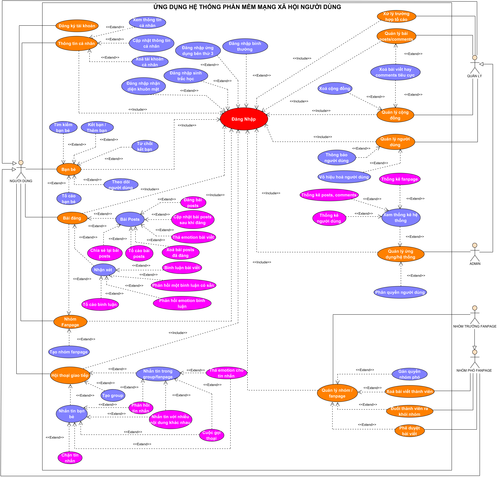

    
    <h1>SolarNet</h1>
    <h3>💏 Ứng dụng phần mềm mạng xã hội người dùng SolarNet 💑</h3>
	

		<a href="#giới-thiệu">📘 Giới Thiệu</a> -
		<a href="#sơ-đồ-use-case">📑 Sơ đồ use-case</a> -
		<a href="#kiến-trúc-phần-mềm">📐 Kiến trúc phần mềm</a> - 
		<a href="#công-nghệ-sử-dụng">📚 Công nghệ sử dụng</a> -
		<a href="#thành-viên-thực-hiện">👪 Thành viên thực hiện</a>
	

## GIỚI THIỆU

Ứng dụng phần mềm <b>SolarNet</b> là một ứng dụng cho phép mọi người có thể tham gia mạng xã hội kết nối lại với nhau trên toàn thế giới. Với mong
muốn rằng, mọi người ở mọi phương có thể liên lạc với nhau với nhiều giao thức khác nhau nhưng với ứng dụng này, hỗ trợ các cách giao tiếp đa dạng khác
nhau sẽ mang đến trải nghiệm cho người dùng cảm thấy thoải mái, tối ưu và tiện nhất có thể.
 
😍 🌏 ❤️ 👫

 

Một số tính năng đặc trưng của ứng dụng:
1. Đăng các bài posts lên trên trang cá nhân, group/fanpage.
2. Nhận xét các bài posts đã được đăng trên mạng xã hội.
3. Chia sẻ lại bài posts.
4. Tìm kiếm, kết bạn trên cộng đồng.
5. Có thể tạo một group/fanpage trên mạng để có thể thêm mọi người vào.
6. Nhắn tin bạn bè, group/fanpage. Có thể thực hiện các cuộc gọi thoại.

## SƠ ĐỒ USE-CASE

Sơ đồ use-case mô tả các chức năng ứng với các actors trong hệ thống:

	

* NGƯỜI DÙNG: là những người cơ bản, sử dụng ứng dụng phần mềm.
* QUẢN LÝ: là những người có chức vụ lớn hơn "NGƯỜI DÙNG", họ có thể quản lý các hoạt động diễn ra trên ứng dụng.
* ADMIN: là người chủ sở hữu ứng dụng, có quyền hạn cao nhất.
* NHÓM TRƯỞNG PANPAGE: là những người dùng nhưng khi xét khía cạnh trong một nhóm, tổ chức hay gọi là panage là những người đứng đầu trong nhóm đó.
* NHÓM PHÓ PANPAGE: là những người giống như "NHÓM TRƯỞNG" nhưng họ có ít quyền hạn hơn so với nhóm trưởng.

## KIẾN TRÚC PHẦN MỀM

Sơ đồ kiến trúc phần mềm:

	

## CÔNG NGHỆ SỬ DỤNG

	<ul>
		<li>Frontend: Website (ReactJS), Mobile (Flutter), Desktop App (C# Winform)</li>
		<li>Backend: Java (Spring boot), Javascript/Typescript (NodeJS), Python (Flask)</li>
		<li>Database: MariaDB, MongoDB, Redis</li>
		<li>Security: JWT (Json Web Token), Spring OAuth2 (đăng nhập bằng: Github, Discord, Microsoft,...)</li>
		<li>CI/CD: Docker, Jenkins</li>
		<li>Deployment: Vercel (cho Frontend), EC2 (AWS - cho Backend)</li>
		<li>Kiến trúc: Microservices, Event-driven và Multi-layered</li>
		<li>Công nghệ khác: AI (dự báo, xử lý ảnh,...), Blockchain, Apache Kafka, Socket I/O</li>
		<li>Công cụ khác: S3 (AWS - Lưu trữ dữ liệu), Jira (lập kế hoạch)</li>
	</ul>

 

## THÀNH VIÊN THỰC HIỆN
<table align="center">
	<tbody> 
		<tr align="center" valign="top">
			<td>
				<a href="https://github.com/TDMinhNhat">
					
					
Minh Nhật

				</a>
			</td>
			<td>
				<a href="https://github.com/DangQuang31122022">
					
					
Đăng Quang

				</a>
			</td>
		</tr>
	</tbody>
</table>